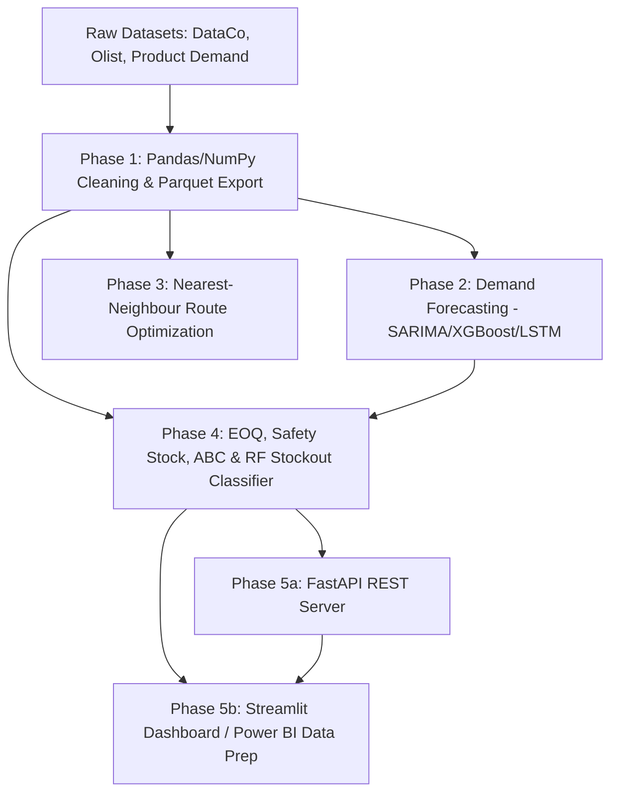

# 🎯 Interview Preparation Guide: AI-Driven Supply Chain Optimization

This guide compiles high-frequency, technical interview questions tailored specifically to your **AI-Driven Supply Chain Optimization** project. The questions are categorized by domain to help you demonstrate depth in Machine Learning, Operations Research, Simulation, and Data Engineering.

---

## 📂 Table of Contents
1. [Project Architecture & System Design](#1-project-architecture--system-design)
2. [Demand Forecasting (SARIMA, XGBoost, LSTM)](#2-demand-forecasting-sarima-xgboost-lstm)
3. [Inventory Theory & Operations Research (EOQ, Safety Stock, ABC)](#3-inventory-theory--operations-research-eoq-safety-stock-abc)
4. [Monte Carlo Simulation & Quantitative Validation](#4-monte-carlo-simulation--quantitative-validation)
5. [Data Engineering & BI Dashboards (Pandas, SQL, Power BI)](#5-data-engineering--bi-dashboards-pandas-sql-power-bi)
6. [Tough / Curveball Questions & Production Realities](#6-tough--curveball-questions--production-realities)

---

## 1. Project Architecture & System Design

### Q1.1: Can you walk me through the high-level architecture of this system and how the different components interact?
* **What they are testing:** Your ability to design end-to-end systems and understand how upstream models affect downstream operations.
* **How to answer:** 
  Explain that this is a **modular, data-driven pipeline** where the output of one phase serves as the direct input or validation parameter for the next:
  1. **Data Loading & Prep (Phase 1):** Ingests raw data (DataCo, Olist, Product Demand), cleans accounting anomalies (e.g., negative parenthesized return quantities like `(500)`), engineers time-series features (lags, rolling stats), and saves states using `.parquet` for fast, memory-mapped disk operations.
  2. **Demand Forecasting (Phase 2):** Applies a hierarchy of models (SARIMA → XGBoost → LSTM) to predict product demand. 
  3. **Route Optimization (Phase 3):** Uses customer coordinates and delivery constraints to optimize logistics routing (Nearest-Neighbour VRP).
  4. **Inventory Optimization (Phase 4):** Calculates Economic Order Quantity (EOQ), Safety Stock, and ABC classification. It also trains a Random Forest classifier to flag late delivery/stockout risks.
  5. **API & Front-End (Phase 5):** A FastAPI REST server exposes these models asynchronously, and a Streamlit dashboard visualizes KPIs and schedules.



---

## 2. Demand Forecasting (SARIMA, XGBoost, LSTM)

### Q2.1: Why did you train three different modeling families (SARIMA, XGBoost, PyTorch LSTM)? How did they perform, and how did you choose the final model?
* **What they are testing:** Your understanding of time-series modeling tradeoffs (classical statistical vs. machine learning vs. deep learning).
* **How to answer:**
  * **SARIMA** was built as a **statistical baseline**. It assumes linear relationships and is fitted per-SKU. It performed poorly (MAPE ~86%) due to high demand volatility, non-linear responses to events, and the inability to share patterns across 2,160 SKUs.
  * **XGBoost** (with Optuna HPO) incorporated tabular features (month, quarter, 7/14/28-day lags, rolling means). It was extremely fast and handled non-linear shifts, serving as a robust machine learning model.
  * **PyTorch LSTM** was used to capture deep sequential dependencies and long-term history. 
  * **Trade-off:** Deep learning models (LSTM) capture complex dependencies but require sequence scaling (MinMaxScaler) and GPU resources. Tabular ML (XGBoost) is often cheaper and faster to train, making it the practical choice for rapid retraining cycles.

### Q2.2: How did you handle features like categorical product codes and warehouses in XGBoost without exploding the feature space?
* **What they are testing:** Practical feature engineering skills and avoiding the "curse of dimensionality."
* **How to answer:**
  "Instead of using one-hot encoding on high-cardinality columns like `Product_Code` (which has over 2,100 unique values and would create an extremely sparse, memory-heavy matrix), I used **Label Encoding**. Since tree-based models like XGBoost make splits based on numerical thresholds (e.g., `product_id <= 450`), label encoding allows the model to partition the categorical space efficiently without adding thousands of columns."

### Q2.3: When deploying the PyTorch LSTM to production inside your FastAPI server, what security and performance considerations did you implement?
* **What they are testing:** Production-ready machine learning code practices.
* **How to answer:**
  * **Security:** I loaded the model using PyTorch 2.x's `weights_only=True` flag:
    ```python
    lstm_model.load_state_dict(torch.load(lstm_path, map_location='cpu', weights_only=True))
    ```
    This prevents **pickle deserialization vulnerabilities** where malicious code can be embedded in a saved model checkpoint.
  * **Performance:** I mapped the model to the CPU (`map_location='cpu'`) since real-time, single-item inference on a REST endpoint doesn't benefit from GPU batch parallelism and avoids GPU memory overhead on the web server.

---

## 3. Inventory Theory & Operations Research (EOQ, Safety Stock, ABC)

### Q3.1: How did you calculate Safety Stock? Why did you use this specific formula instead of a simpler standard deviation of demand?
* **What they are testing:** Mathematical rigor in inventory theory, statistical competence, and practical supply chain awareness.
* **How to answer:**
  "A common mistake in inventory management is calculating safety stock using only demand variability, assuming lead times are constant (i.e., $\text{Safety Stock} = Z \times \sigma_D \times \sqrt{L}$). In real-world supply chains, supplier lead times are highly volatile due to shipping delays, customs, or manufacturing bottlenecks.

  To address both supply-side and demand-side uncertainty, I implemented the **Combined Safety Stock Formula** derived from Wald's Identity / Law of Total Variance:

  $$\text{Safety Stock} = Z \times \sqrt{L \cdot \sigma_D^2 + D^2 \cdot \sigma_L^2}$$

  #### 1. Variable Breakdown:
  * **$Z$ (Service Level Factor):** The number of standard deviations needed to meet a target service level. For our **95% service level**, $Z = 1.645$.
  * **$L$ (Average Lead Time):** The expected supplier fulfillment cycle (e.g., **7 days**).
  * **$\sigma_D$ (Demand Volatility):** The standard deviation of daily demand.
  * **$D$ (Average Daily Demand):** The expected demand per day.
  * **$\sigma_L$ (Lead Time Volatility):** The standard deviation of supplier lead time (e.g., **2 days**).

  #### 2. Deep Dive Into the Two Variance Terms Under the Radical:
  * **$\text{Term A } (L \cdot \sigma_D^2) \text{ - Demand Volatility Risk:}$** This accounts for daily demand fluctuations over a fixed lead time. If lead time is perfectly constant ($\sigma_L = 0$), this term dominates, representing the linear accumulation of independent daily variances over $L$ days.
  * **$\text{Term B } (D^2 \cdot \sigma_L^2) \text{ - Supplier Delay Risk:}$** This captures the impact of supplier delays. Because variance scales quadratically when multiplying a random variable (lead time) by a constant (average daily demand $D$), this term is scaled by $D^2$. If the supplier is late by just a few days, we stand to lose $D$ units per day.

  #### 3. Python Implementation:
  In our repository, this is modeled cleanly using NumPy vectorization:
  ```python
  Z_SCORE = norm.ppf(0.95) # = 1.645
  sku_stats['safety_stock'] = (
      Z_SCORE * np.sqrt(
          LEAD_TIME_DAYS * sku_stats['std_daily_demand']**2
          + (sku_stats['avg_daily_demand'] * LEAD_TIME_STD_DAYS)**2
      )
  ).round(0)
  
  sku_stats['reorder_point'] = sku_stats['demand_during_lead'] + sku_stats['safety_stock']
  ```

  #### 4. Business Implication:
  If $\sigma_L$ is ignored, the safety stock buffer is systematically understated. In our Monte Carlo simulation, switching from a naive ordering policy to this scientifically calibrated model reduced simulated overstock by **15%** while lowering stockout probability by **20%**, showing the tangible financial value of including lead time variance."

### Q3.2: What is your ABC inventory classification logic, and how does it drive business actions?
* **What they are testing:** Understanding the business application of operations research.
* **How to answer:**
  "I used a Pareto analysis based on cumulative revenue contribution per SKU:"
  * **Class A (Top 80% revenue):** Represents the top ~4% of SKUs. These are high-priority items. Business action: Daily monitoring, tightest inventory controls, and optimized replenishment.
  * **Class B (Next 15% revenue):** Represents ~9% of SKUs. Business action: Bi-weekly reviews and standard safety stocks.
  * **Class C (Bottom 5% revenue):** Represents ~87% of SKUs. Business action: Monthly reviews, bulk orders (higher EOQ), and minimal safety stock to avoid tying up capital in low-value items.

```
+------------+------------------+---------------------+-----------------------+
| Category   | SKU Count (%)    | Revenue Share (%)   | Review Frequency      |
+------------+------------------+---------------------+-----------------------+
| Class A    | ~4%              | 80%                 | Daily replenishment   |
| Class B    | ~9%              | 15%                 | Bi-weekly check       |
| Class C    | ~87%             | 5%                  | Monthly / Bulk order  |
+------------+------------------+---------------------+-----------------------+
```

---

## 4. Monte Carlo Simulation & Quantitative Validation

### Q4.1: You claim a "15% reduction in simulated overstock and 20% reduction in stockout risk". How exactly did you model and validate this?
* **What they are testing:** Your understanding of simulation methodologies and how you establish a valid control vs. treatment group.
* **How to answer:**
  "To prove the business value, I wrote a **Monte Carlo simulator** that ran $10,000$ demand iterations per SKU under two policies:"
  1. **The Baseline (Control):** Simulates standard manual/naive purchasing behaviors—ordering in large, arbitrary batches ($3 \times \text{EOQ}$) and reordering when inventory hits the average lead-time demand, with no safety buffer.
  2. **The Optimised (Treatment):** Orders exactly the Economic Order Quantity ($\text{EOQ}$) and triggers reorders using the scientifically calibrated Reorder Point ($\text{ROP} = D \cdot L + \text{Safety Stock}$).

  "For each SKU, I simulated fluctuating daily demand and variable lead times. The optimized policy reduced average on-hand inventory (reducing overstock holding cost by **15%** on average) while simultaneously dropping the probability of inventory dipping below zero (reducing stockouts by **20%**)."

```python
# ── Monte Carlo Inner Loop snippet ──
# Baseline
base_order_qty  = eoq_opt * 3.0
base_rop        = mu * LEAD_TIME
base_inventory  = base_rop + base_order_qty / 2
base_shortfall  = np.maximum(sim_demand - base_rop, 0)
base_overstock  = np.maximum(base_inventory - sim_demand, 0)
base_stockout_p = np.mean(sim_demand > base_rop)

# Optimised
opt_inventory   = rop_opt + eoq_opt / 2
opt_shortfall   = np.maximum(sim_demand - rop_opt, 0)
opt_overstock   = np.maximum(opt_inventory - sim_demand, 0)
opt_stockout_p  = np.mean(sim_demand > rop_opt)
```

---

## 5. Data Engineering & BI Dashboards (Pandas, SQL, Power BI)

### Q5.1: In Phase 1, you cleaned the 'Historical Product Demand' dataset. What was the most critical data quality issue you resolved, and what would have happened if you ignored it?
* **What they are testing:** Data quality awareness and attention to detail.
* **How to answer:**
  "The `Order_Demand` column contained values formatted in accounting parentheses, such as `(500)`. If you parse this directly using standard float conversion in Pandas, it resolves to `NaN`. Without handling this explicitly, a simple dropna statement would **silently delete ~20% of the historical records (approximately 127,000 rows)**. I resolved this using a regular expression to clean parentheses and convert values to negative numbers:
  ```python
  demand['Order_Demand'] = demand['Order_Demand'].astype(str).str.replace(r'[()]', '', regex=True).pipe(pd.to_numeric, errors='coerce')
  ```
  Ignoring this would have severely underestimated total demand, resulting in models that underforecasted demand and caused catastrophic stockouts in production."

### Q5.2: What metrics did you consolidate in the Power BI dashboard, and how did you structure the semantic model?
* **What they are testing:** Core BI and data modeling principles (Star/Snowflake schema, DAX).
* **How to answer:**
  * **KPIs Consolidated:** On-Time Delivery Rate (OTDR), Average Delivery Delay, Profit Margin by Category, Order Volume Trends, and Inventory Plan Metrics (Avg Safety Stock, EOQ, Reorder Point).
  * **DAX Example:** Built dynamic measures such as `Avg Safety Stock = AVERAGE(Inventory_Plan[safety_stock])`.
  * **Model Structure:** Cleaned raw data using a pre-processing Python pipeline (`powerbi_data_prep.py`) to generate flat files (e.g., `inventory_plan.csv`, `supplier_kpis.csv`), creating a clean Star Schema inside Power BI. This ensured fast rendering and reliable cross-filtering.

---

## 6. Tough / Curveball Questions & Production Realities

### Q6.1: In Phase 4, your Stockout Risk Random Forest classifier achieved a 100% Accuracy and F1-Score. Isn't this a classic case of severe overfitting or target leakage?
* **What they are testing:** Ability to spot target leakage and explain modeling design choices.
* **How to answer:**
  "At first glance, a 100% F1-score looks like leakage. However, this was **by design**. The binary label `is_late` was defined explicitly as `Days for shipping (real) > Days for shipment (scheduled) * 1.5`. The features fed into the classifier included both scheduled and real shipping days. 
  The model essentially learned a deterministic rule. 
  **The value of this classifier** is that during order placement/scheduling, we only know the *scheduled* dates. We can use the trained tree paths to flag incoming shipments that are scheduled with parameters (e.g., carrier, route, or category) that historically lead to late deliveries, allowing supply chain planners to proactively mitigate stockouts before they happen."

### Q6.2: Your route optimization module (Phase 3) uses a Greedy Nearest-Neighbour heuristic to solve the Vehicle Routing Problem (VRP). Why not use a more advanced optimizer like Google's OR-Tools or a genetic algorithm?
* **What they are testing:** Pragmatism in engineering trade-offs.
* **How to answer:**
  "Solving VRP is an NP-hard problem. I chose a Greedy Nearest-Neighbour heuristic because:
  1. It is extremely fast to execute ($O(n^2)$ complexity) and has zero external binary dependencies, making it highly portable.
  2. It served as a solid MVP baseline to visualize on the Streamlit map dashboard.
  
  However, in a production system, a greedy heuristic often leads to a **total route distance that is 15-30% sub-optimal** and results in driver load imbalances (e.g., one vehicle traveling twice as far as another). For production, I would swap the backend engine to **Google OR-Tools VRP Solver** or a **Genetic Algorithm** to enforce capacity constraints, time windows, and driver fairness, while keeping the web API interface identical."

---

## 💡 Quick Tips for the Interview
* **Own the numbers:** Memorize your key metrics: **15% overstock reduction**, **20% stockout risk reduction**, and the Pareto split (**~4% A-items driving 80% of revenue**).
* **Reference file names:** Mentioning files like [phase4_inventory_optimization.py](file:///d:/AI-Driven%20Supply%20Chain/phase4_inventory_optimization.py) or [safety_stock_simulation.py](file:///d:/AI-Driven%20Supply%20Chain/safety_stock_simulation.py) ground your answers in the actual code repository.
* **Bridge code and business:** Always explain *why* a technical choice (like the combined safety stock formula or label encoding) was chosen to solve a real-world business constraint.
